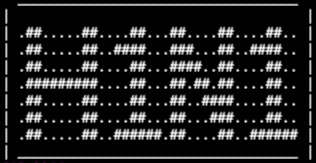

<p align=center>
  
  <br>
  <p align="center">
  <span>  Simple Ddos Attack </span>
  <br>
  <a target="_blank" href="https://www.python.org/downloads/" title="Python version"></a>
  <a target="_blank" href="LICENSE" title="License: MIT"></a>
  
## Info

```console
A Distributed Denial of Service (DDOS) is an attempt to make an
online service unavailable by overwhelming it with traffic from multiple sources.
They target a wide variety of important resources from banks to news websites,
and present a major challenge to making sure people can publish and access important information

```
  
## Installation

```console
# clone the repo
$ git clone https://github.com/kents00/H1N1-PROJECT.git

# change the working directory to sherlock
$ cd H1N1-PROJECT

# install the requirements
$ python3 -m pip install -r requirements.txt
```
## Usage

```console
$ python H1N1.py

[0].DDOS

[UDP]
What is a UDP flood attack?
A UDP flood is a type of denial-of-service attack in which a large number of User Datagram Protocol (UDP) packets are sent to a targeted server with the aim of overwhelming that device’s ability to process and respond. The firewall protecting the targeted server can also become exhausted as a result of UDP flooding, resulting in a denial-of-service to legitimate traffic.

How does a UDP flood attack work?
A UDP flood works primarily by exploiting the steps that a server takes when it responds to a UDP packet sent to one of it’s ports. Under normal conditions, when a server receives a UDP packet at a particular port, it goes through two steps in response:

The server first checks to see if any programs are running which are presently listening for requests at the specified port.
If no programs are receiving packets at that port, the server responds with a ICMP (ping) packet to inform the sender that the destination was unreachable.
A UDP flood can be thought of in the context of a hotel receptionist routing calls. First, the receptionist receives a phone call where the caller asks to be connected to a specific room. The receptionist then needs to look through the list of all rooms to make sure that the guest is available in the room and willing to take the call. Once the receptionist realizes that the guest is not taking any calls, they have to pick the phone back up and tell the caller that the guest will not be taking the call. If suddenly all the phone lines light up simultaneously with similar requests then they will quickly become overwhelmed.
As each new UDP packet is received by the server, it goes through steps in order to process the request, utilizing server resources in the process. When UDP packets are transmitted, each packet will include the IP address of the source device. During this type of DDoS attack, an attacker will generally not use their own real IP address, but will instead spoof the source IP address of the UDP packets, impeding the attacker’s true location from being exposed and potentially saturated with the response packets from the targeted server.

As a result of the targeted server utilizing resources to check and then respond to each received UDP packet, the target’s resources can become quickly exhausted when a large flood of UDP packets are received, resulting in denial-of-service to normal traffic.

[TCP]
TCP SYN flood (a.k.a. SYN flood) is a type of Distributed Denial of Service (DDoS) attack that exploits part of the normal TCP three-way handshake to consume resources on the targeted server and render it unresponsive.

Essentially, with SYN flood DDoS, the offender sends TCP connection requests faster than the targeted machine can process them, causing network saturation.

Attack description
When a client and server establish a normal TCP “three-way handshake,” the exchange looks like this:

Client requests connection by sending SYN (synchronize) message to the server.
Server acknowledges by sending SYN-ACK (synchronize-acknowledge) message back to the client.
Client responds with an ACK (acknowledge) message, and the connection is established.
In a SYN flood attack, the attacker sends repeated SYN packets to every port on the targeted server, often using a fake IP address. The server, unaware of the attack, receives multiple, apparently legitimate requests to establish communication. It responds to each attempt with a SYN-ACK packet from each open port.

The malicious client either does not send the expected ACK, or—if the IP address is spoofed—never receives the SYN-ACK in the first place. Either way, the server under attack will wait for acknowledgement of its SYN-ACK packet for some time.

During this time, the server cannot close down the connection by sending an RST packet, and the connection stays open. Before the connection can time out, another SYN packet will arrive. This leaves an increasingly large number of connections half-open – and indeed SYN flood attacks are also referred to as “half-open” attacks. Eventually, as the server’s connection overflow tables fill, service to legitimate clients will be denied, and the server may even malfunction or crash.

While the “classic” SYN flood described above tries to exhaust network ports, SYN packets can also be used in DDoS attacks that try to clog your pipes with fake packets to achieve network saturation. The type of packet is not important. Still, SYN packets are often used because they are the least likely to be rejected by default.

[PROXY]
Another type of system reconfiguration attack is a proxy attack. The attacker installs a proxy through which the user's network traffic will be passed. The attacker can glean confidential information from the traffic while retransmitting it back and forth between the victim and a remote website. This is a form of a man-in-the-middle attack.
```

 
</p>